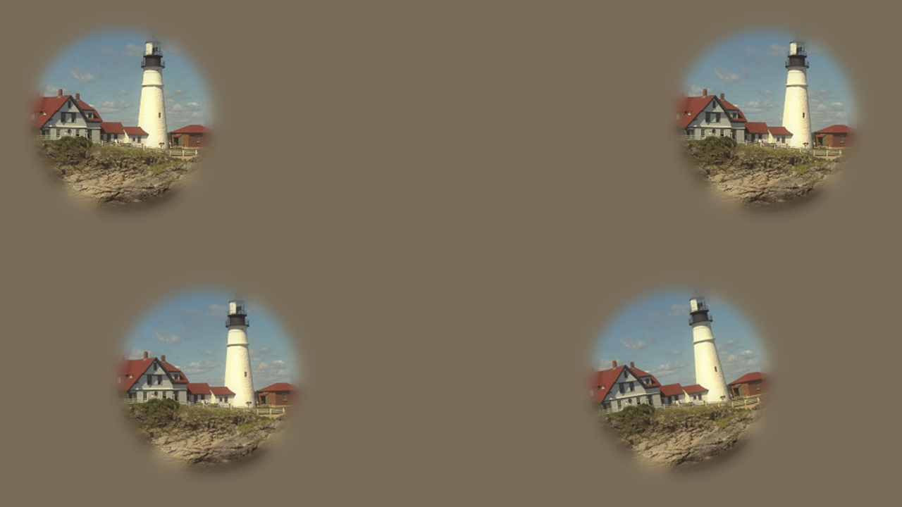
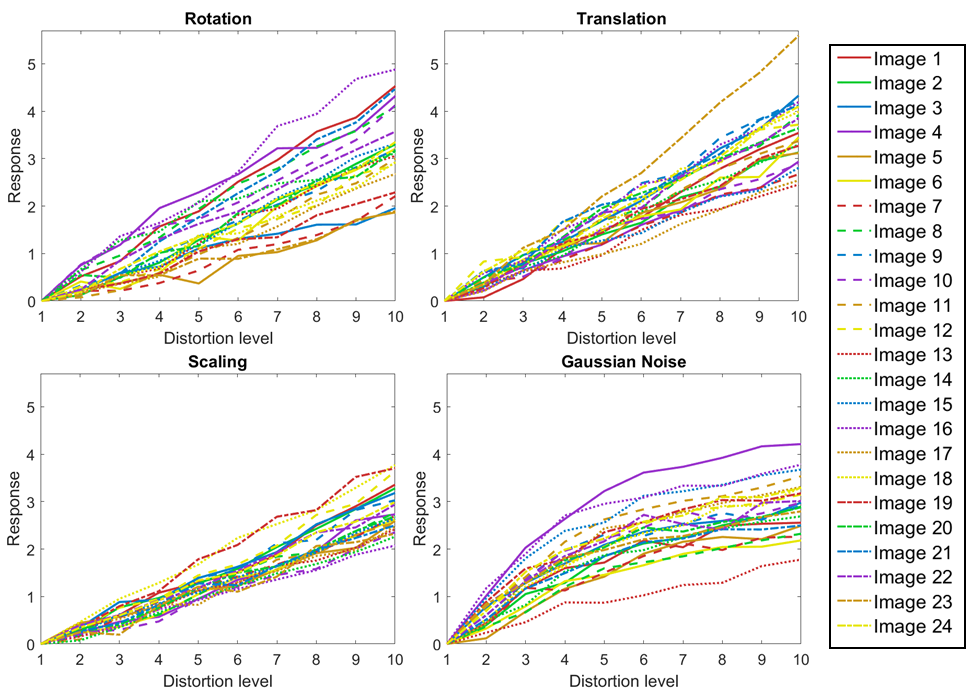

# RAID: Human Responses to Affine Image Distortions

This repository contains the data, code, and usage examples related to the article:

**RAID-Database: Human Responses to Affine Image Distortions**  
Paula Daudén-Oliver*, David Agost-Beltran, Emilio Sansano-Sansano, Raúl Montoliu, Valero Laparra, Jesús Malo, Marina Martínez-García  
[*Scientific Data, Nature Portfolio (under review)*]

---

## 🧠 Project Overview

**RAID** (Responses to Affine Image Distortions) is a perceptual image quality database built from human judgments. Unlike traditional databases focused on digital distortions, RAID investigates suprathreshold **affine transformations** — **rotation, translation, scaling**, and **Gaussian noise** — which are more representative of distortions encountered in natural viewing conditions.

Subjective responses were collected using the psychophysical method **Maximum Likelihood Difference Scaling (MLDS)**. Over **40,000 image comparisons** were performed by **210 human observers** under controlled laboratory conditions.

---

## 📂 Repository Structure

- `answers.csv`: Raw experimental data (individual responses from observers).
- `responses.csv`: MLDS response curves per image, distortion, and distortion level (normalized).
- `images/`: Original and distorted images (available via HuggingFace).
- `notebooks/`:
  - `Load_DDBB_example.ipynb`: Load images and responses.
  - `Load_RAW_data_and_compute_MLDS.ipynb`: Compute MLDS curves from raw data.
  - `Load_MLDS_data_and_plot_curves.ipynb`: Plot normalized response curves.
  - `Convert_MLDS_to_MOS.ipynb`: Convert MLDS responses to MOS (aligned with TID2013).
  - `Load_RAW_data_and_plot_left_right_RT.ipynb`: Analyze reaction times and decision patterns.

---

## 📊 What’s in the Database?

- **888 images**: 24 reference images + 864 distorted versions.
- **4 types of distortion**:
  - Rotation (up to ±18°)
  - Translation (up to 0.63° visual angle)
  - Scaling (up to ±9%)
  - Gaussian noise (matched with TID2013 levels)
- **MLDS curves**: Quantify perceptual difference as a function of distortion level.
- **Reaction times**: Provide additional validation via Piéron’s law.

---

## 🧪 Technical Validation

Our dataset was validated at multiple levels:
1. Reproduction of **absolute detection thresholds** for each distortion type.
2. Compliance with **Piéron’s law** (reaction time vs. task difficulty).
3. Alignment with **existing databases** like TID2013, and improved performance as shown through **Group-MAD** experiments.

---

## 📥 Data Access

The full dataset and images are available at:  
📦 https://huggingface.co/datasets/paudauo/Affine_Transformation_Database

---

## 🛠 Requirements

The code has been tested with the following:
- Python 3.10.12  
- Numpy 1.26.4  
- Pandas 2.2.3  
- JAX 0.4.35  

---

## 📜 License

The code is released under the **Apache 2.0 License**.

---

## 🤝 Citation

If you use this database or code, please cite the corresponding article (when available). In the meantime, you may reference it as:

> Daudén-Oliver, P. et al. *RAID-Database: Human Responses to Affine Image Distortions*. Scientific Data (under review). GitHub: https://github.com/paudauo/BBDD_Affine_Transformations

---

## 🧪 Experimental Design & Results

### 👁️ Figure 2 — Example Trial: MLDS Psychophysical Task

In each trial, participants were shown **two pairs of images** (quadruple display): one pair on the left and one on the right. Their task was to **choose the pair that showed a larger perceptual difference**. Each trial involved 4 distorted versions of the same reference image, and trials were designed to balance difficulty and prevent trivial answers.

A total of **210 observers** completed over **40,000 trials**, under controlled lighting conditions and consistent viewing distance. Reaction times were recorded for every decision, providing insight into perceptual processing.

---

### 📈 Figure 3 — MLDS Response Curves

The following figure shows the perceptual response curves for each distortion type (**rotation**, **translation**, **scaling**, and **Gaussian noise**), computed using the **Maximum Likelihood Difference Scaling (MLDS)** method.

As distortion level increases:
- **Affine distortions** (rotation, translation, scaling) show an approximately **linear perceptual response**.
- **Gaussian noise** exhibits a **saturating response**, aligning with established perceptual models.

These curves illustrate how perceptual difference scales with objective distortion levels, offering a reliable benchmark for image quality assessment.

---
